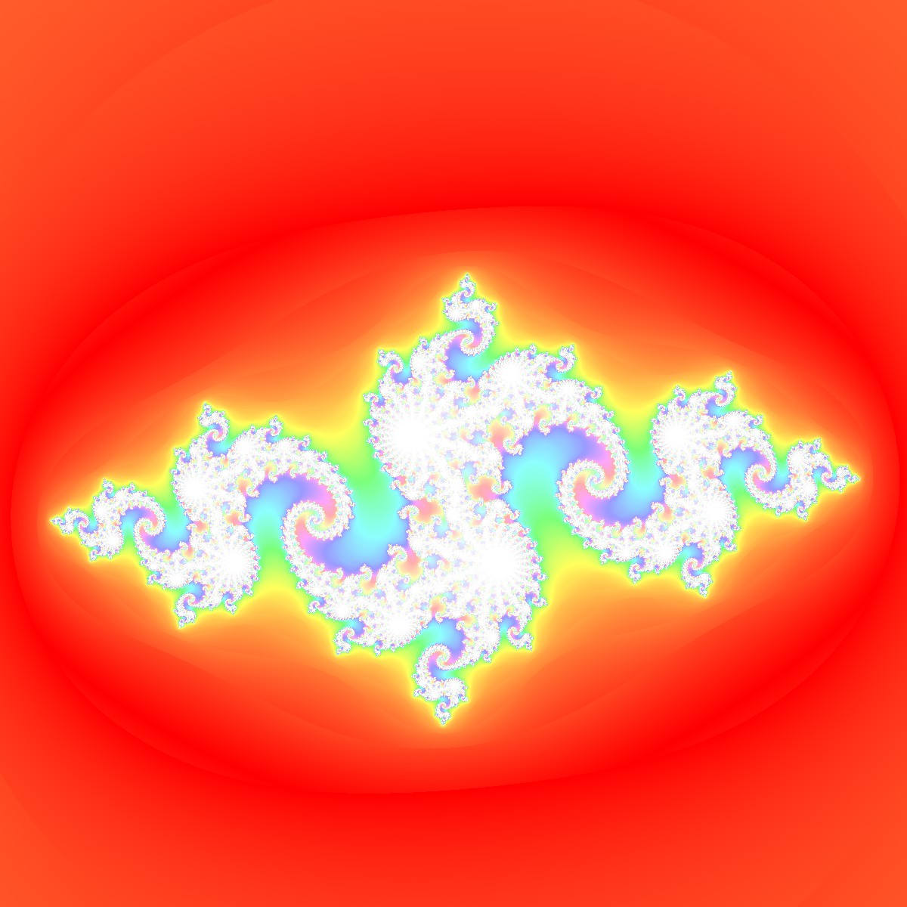

# Fractal
This Application allows you to view different kinds of fractals.
You can zoom and move the view as close as you want since we use double precision

### Controls:
#### Move: ```Mouse Left```
#### Zoom: ```Mouse wheel```
#### Increase maximum iterations: ```A```
#### Decrease maximum iterations: ```D```
#### Enable multithreading: ```Q```
#### Disable multithreading: ```E```
#### Save to file: ```Ctrl``` + ```S```

### Outputs:
#### Mandelbrot:

#### Julia:

#### Burning ship:

#### Tricorn:

